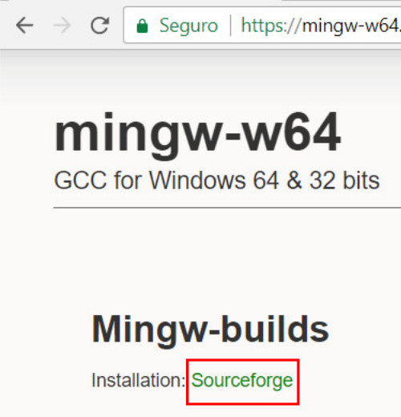
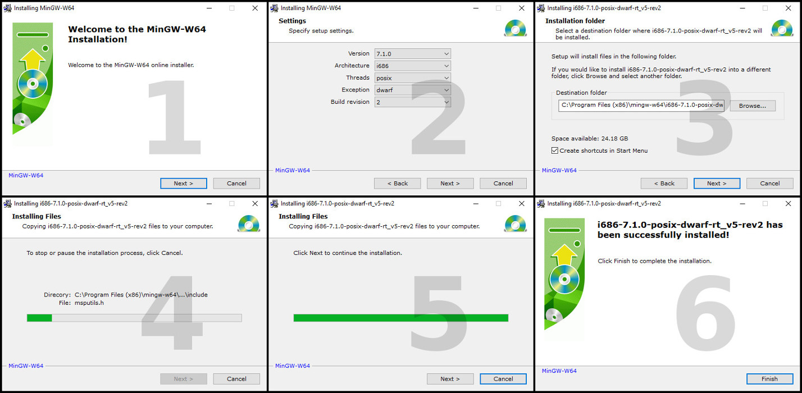
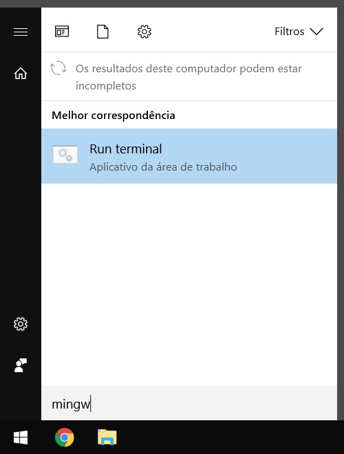
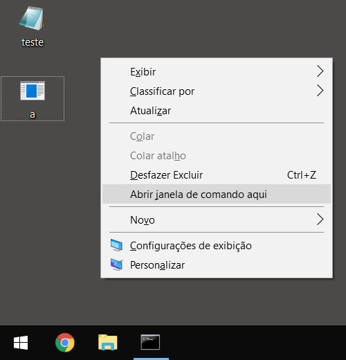
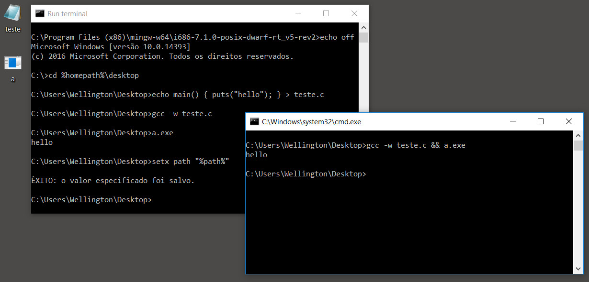

**UPDATE (07-09-2018)<br>Descobri uma forma ainda mais simples de instalar o GCC que é usando o Scoop. Para saber mais sobre esta ferramenta, leia [Instalando e usando o Scoop, um instalador de linha de comando para Windows](/instalando-e-usando-o-instalador-scoop/).**

<hr><br>

O [GCC](https://gcc.gnu.org/) é um compilador de C, C++ e de [algumas outras linguagens](https://gcc.gnu.org/onlinedocs/gcc-7.2.0/gcc/G_002b_002b-and-GCC.html).

Ele é parte do projeto [GNU](https://www.gnu.org/gnu/gnu-history.html) e pode ser instalado no Windows através do [MinGW](http://mingw-w64.org).

Há várias formas de se instalar o MinGW e a que apresento aqui é a que considero mais simples.

## Download e instalação

Acesse o link da página de download abaixo e clique em "SourceForge".

[http://mingw-w64.org/doku.php/download/mingw-builds](http://mingw-w64.org/doku.php/download/mingw-builds)



Execute o arquivo baixado.

O instalador permitirá que você altere alguns dados do compilador e o local de instalação. Não altere estes dados a menos que saiba o que está fazendo.

Ele fará o download das dependências e o processo todo se resume a ir clicando em _Next_ e então em _Finish_ para concluir.



## Testando a instalação

Abra o _Menu Iniciar_, digite "mingw" e clique em _Run terminal_.



Uma janela do Prompt de Comando reconfigurada pelo MinGW se abrirá.

Digite o comando abaixo e aperte _Enter_ para mudar de diretório.

```bash
cd %homepath%\desktop
```

Digite o comando abaixo e aperte Enter para criar um arquivo chamado _teste.c_ na Área de Trabalho.

```bash
echo main() { puts("hello"); } > teste.c
```

Use o seguinte comando para compilar.

```bash
gcc -w teste.c
```

Isso vai gerar um arquivo chamado _a.exe_, este é o programa já compilado. Execute-o com o seguinte comando:

```bash
a.exe
```

A mensagem "hello" deve ser exibida. Se isso acontecer, parabéns, o GCC foi instalado com sucesso!

## [Opcional] Configurando o Path

Ainda não é possível executar o GCC a partir de qualquer janela do Prompt de Comando, estamos dependentes da janela própria do MinGW.

Para corrigir isso é necessário adicionar o caminho do compilador à variável de ambiente _Path_. Para isso use o seguinte comando:

```bash
setx path "%path%"
```

Para testar, segure a tecla _Shift_, clique com o **botão direito** do mouse em qualquer lugar na Área de Trabalho e clique em _Abrir janela de comando aqui_.



No Prompt de Comando recém aberto, tente compilar e executar novamente o programa com o comando abaixo.

```bash
gcc -w teste.c && a.exe
```

Se a mensagem "hello" aparecer sem erros, significa que você está pronto para começar a programar sem limites!


