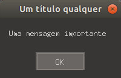
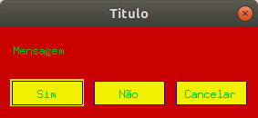

## Apresentação

Quando trabalhando com SDL 2, como desenvolvedor, gosto de fazer testes usando a função `SDL_Log()` para imprimir mensagens no terminal e saber como anda a execução do meu código.

Porém, como usuário, ao executar um jogo, não é muito atrativo ter que abrir o terminal e interpretar as mensagens ali apresentadas para saber o que aconteceu de errado.

Como uma alternativa ao uso das mensagens no terminal, a SDL 2 fornece funções para criar caixas de mensagem.



Estas caixas podem conter apenas texto simples para alertar o usuário sobre um erro ou outro tipo de informação importante, bem como botões para que ele tome alguma decisão.

## Considerações iniciais

Para este guia vou considerar que você já tem um ambiente de desenvolvimento devidamente configurado e é capaz de compilar e executar os exemplos apresentados sem problemas.

Todos os exemplos foram testados nas seguintes plataformas:

- Ubuntu 18.04
- Windows 10
- Android 7.0

As funções que criam essas caixas podem ser invocadas mesmo antes da invocação da `SDL_Init()`, por isso a omiti dos exemplos para deixá-los mais limpos. Num código real, você ainda deve inicializar e finalizar corretamente os subsistemas da biblioteca.

## Uma caixinha simples

Se tudo o que você quer é uma caixa com uma mensagem simples, a função `SDL_ShowSimpleMessageBox()` fará bem o trabalho.

Trata-se de uma caixinha com título, uma mensagem (que é opcional) e um botão _OK_.

```cs
#include <SDL.h>

int main()
{
    if ( SDL_ShowSimpleMessageBox(0, "Título", "Mensagem", NULL) < 0 )
        SDL_Log("%s", SDL_GetError());

    return 0;
}
```

### Checando erros

Esta função retorna 0 em caso de sucesso e um valor negativo em caso de falha.

Podemos usar a `SDL_GetError()` para ter uma descrição do ocorrido caso necessário.

### Definindo o tipo de caixa

O primeiro argumento é uma flag que pode ser uma das 3 apresentadas abaixo.

- `SDL_MESSAGEBOX_ERROR`
- `SDL_MESSAGEBOX_WARNING`
- `SDL_MESSAGEBOX_INFORMATION`

A ideia é que, dependendo da flag, a caixa exiba um ícone característico. Porém, fiz o teste no Window, Ubuntu e Android e em nenhuma dessas plataformas o ícone foi exibido.

### Título e mensagem

Os próximos dois argumentos são autoexplicativos.

São o texto que aparecerá na barra de título seguido pela mensagem que aparecerá no corpo da caixa.

A mensagem pode ser `NULL`, mas o título deve ser uma string válida ou um erro ocorrerá.

### Janela-mãe e caixas independentes

O último argumento representa a janela-mãe. Pode ser nulo caso a caixa seja independente.

No Ubuntu, normalmente a caixa é criada e posicionada bem no centro de sua janela-mãe e caso passemos `NULL` como argumento, a caixa é posicionada no centro da tela.

## Criando caixas de diálogo mais complexas

A função `SDL_ShowMessageBox()` nos dá maior controle.

Ela permite a criação de caixas com nenhum ou vários botões e com o texto que quisermos neles.

É possível saber exatamente em qual botão o usuário clicou e realizar ações diferentes com base nesta informação.

E também podemos alterar as cores de cada elemento em plataformas que suportam este recurso! Em meus testes, foi possível criar caixas coloridas no Ubuntu e no Android.

O primeiro argumento representa os dados da caixa que veremos mais [a frente](#definindo-dados-da-caixa-de-mensagem), e o segundo é um ponteiro para uma variável que conterá o _id_ do botão clicado pelo usuário, é por ela que saberemos qual ação tomar.

### Verificando erros

Assim como a primeira função, esta retorna 0 em caso de sucesso e um valor negativo em caso de falha. Veja [Checando Erros](#checando-erros) da seção anterior para mais informações.

### Definindo dados da caixa de mensagem

O primeiro argumento desta função deve ser um ponteiro para uma `SDL_MessageBoxData`, uma estrutura que contém os dados usados na criação da caixa.

```cs
#include <SDL.h>

int main()
{
    SDL_MessageBoxData message_box_data = {0};
    message_box_data.flags       = 0;
    message_box_data.window      = NULL;
    message_box_data.title       = "Titulo";
    message_box_data.message     = "Mensagem";
    message_box_data.numbuttons  = 0;
    message_box_data.buttons     = NULL;
    message_box_data.colorScheme = NULL;

    if ( SDL_ShowMessageBox(&message_box_data, NULL) < 0 )
        SDL_Log("%s", SDL_GetError());

    return 0;
}
```

Como visto no código acima, esta estrutura contém vários membros e a maioria deles funciona de forma semelhante aos argumentos da função `SDL_ShowSimpleMessageBox()`.

O membro `flag` define o tipo de janela, veja [a seção anterior](#definindo-o-tipo-de-caixa) para conhecer os valores possíveis e maiores detalhes.

O membro `window` representa a janela-mãe da caixa, seu valor pode `NULL` veja [a seção anterior](#janela-mãe-e-caixas-independentes) para maiores informações.

Os membros `title` e `message` são, respectivamente, o texto da barra de título e o texto do corpo da caixa. O membro `message` pode ser `NULL`. Veja [a seção anterior](#título-e-mensagem).

O membro `buttons` é um ponteiro para um array de `SDL_MessageBoxButtonData`, uma estrutura que contém informações sobre os botões que farão parte da nossa caixinha.

O membro `numbuttons` representa a quantidade de botões que usaremos. Essa quantidade deve ser igual a quantidades de elementos contido no array mencionado acima.

Por último, `colorScheme` é um ponteiro para uma estrutura do tipo `SDL_MessageBoxColorScheme`. Ela contém informações sobre as cores personalizadas.

### Adicionando botões

Podemos adicionar botões para dar ao usuário opções diante de uma determinada situação, para isso usamos um array de `SDL_MessageBoxButtonData`.

```cs
SDL_MessageBoxButtonData button_data[3] = {0};
button_data[0].flags    = SDL_MESSAGEBOX_BUTTON_RETURNKEY_DEFAULT;
button_data[0].buttonid = 0;
button_data[0].text     = "Sim";

button_data[1].flags    = SDL_MESSAGEBOX_BUTTON_ESCAPEKEY_DEFAULT;
button_data[1].buttonid = 1;
button_data[1].text     = "Não";

button_data[2].flags    = 0;
button_data[2].buttonid = 2;
button_data[2].text     = "Cancelar";
```

É possível usar uma variável comum caso você precise de apenas um botão.

```cs
SDL_MessageBoxButtonData button_data = {0};
button_data.flags    = 0;
button_data.buttonid = 0;
button_data.text     = "Texto";
```

Como podemos ver nos trechos acima, esta estrutura possui 3 membros.

O membro `buttonid` é o número que representará este botão. É o valor que será passado para o segundo argumento da `SDL_ShowMessageBox()` caso o botão seja clicado.

O membro `text` é simplesmente o texto que aparecerá dentro do botão.

E o membro `flags` é um pouco mais interessante como veremos a seguir.

#### Definindo comportamento especial com flags

O membro `flags` é usado para definir um comportamento especial. Ela pode ter 3 possíveis valores: 0, `SDL_MESSAGEBOX_BUTTON_RETURNKEY_DEFAULT` e `SDL_MESSAGEBOX_BUTTON_ESCAPEKEY_DEFAULT`.

Com o valor 0 nada de especial acontece.

Com `SDL_MESSAGEBOX_BUTTON_RETURNKEY_DEFAULT` significa que aquele botão será ativado caso o usuário pressionar a tecla _Enter_.

Com `SDL_MESSAGEBOX_BUTTON_ESCAPEKEY_DEFAULT` significa que o botão será ativado caso o usuário pressione a tecla _Esc_.

> **NOTA:** _No Windows há um comportamento estranho ao usar estas teclas. Pressionando Enter, ele entende como "Não" e pressionando Esc, ele entende como "Cancelar"._
>
> _No Android, com um teclado físico, não houve esse problema._

#### Testando nossos botões

Com os dados definidos, basta passá-los para o membro `buttons` da estrutura `SDL_MessageBoxData`. Não podemos esquecer de passar também a quantidade de botões correta.

```cs
message_box_data.numbuttons = 3;
message_box_data.buttons    = button_data;
// use &button_data caso a variável não seja um array, assim:
// message_box_data.buttons = &button_data;
```

Segue abaixo o código completo para testar.

```cs
#include <SDL.h>

int main()
{
    SDL_MessageBoxButtonData button_data[3] = {0};
    button_data[0].flags    = SDL_MESSAGEBOX_BUTTON_RETURNKEY_DEFAULT;
    button_data[0].buttonid = 0;
    button_data[0].text     = "Sim";

    button_data[1].flags    = SDL_MESSAGEBOX_BUTTON_ESCAPEKEY_DEFAULT;
    button_data[1].buttonid = 1;
    button_data[1].text     = "Não";

    button_data[2].flags    = 0;
    button_data[2].buttonid = 2;
    button_data[2].text     = "Cancelar";

    SDL_MessageBoxData message_box_data = {0};
    message_box_data.flags       = 0;
    message_box_data.window      = NULL;
    message_box_data.title       = "Titulo";
    message_box_data.message     = "Mensagem";
    message_box_data.numbuttons  = 3;
    message_box_data.buttons     = button_data;
    message_box_data.colorScheme = NULL;

    int buttonid;

    if ( SDL_ShowMessageBox(&message_box_data, &buttonid) < 0 )
        SDL_Log("%s", SDL_GetError());
    else if ( buttonid == -1 )
        SDL_Log("Você NÃO clicou nos botões");
    else
        SDL_Log("Você clicou no botão %s", button_data[buttonid].text);

    return 0;
}
```

> **NOTA:** _No Ubuntu a caixa é exibida com o botão "Fechar", aquele "X" no topo das janelas, e, se clicarmos neste botão, `buttonid` será igual a -1._
>
> _Isso não acontece no Windows e nem no Android, pois a caixa exibida nessas plataformas não possui este "X"._

## Personalizando cores

Há 5 elementos que podem ser personalizados.

- `SDL_MESSAGEBOX_COLOR_BACKGROUND` (O fundo da caixa)
- `SDL_MESSAGEBOX_COLOR_TEXT` (O texto)
- `SDL_MESSAGEBOX_COLOR_BUTTON_BORDER` (A borda do botão)
- `SDL_MESSAGEBOX_COLOR_BUTTON_BACKGROUND` (O fundo do botão)
- `SDL_MESSAGEBOX_COLOR_BUTTON_SELECTED` (O texto do botão quando o mouse está sobre ele ou quando está pressionado

A estrutura que representa as cores dos elementos, `SDL_MessageBoxColorScheme`, possui apenas o membro `colors`.

Este membro é um array de 5 elementos do tipo `SDL_MessageBoxColor`, uma estrutura contendo os valores em RGB.

```cs
SDL_MessageBoxColorScheme color_scheme = {0};
// Vermelho
color_scheme.colors[SDL_MESSAGEBOX_COLOR_BACKGROUND].r        = 200;
color_scheme.colors[SDL_MESSAGEBOX_COLOR_BACKGROUND].g        =   0;
color_scheme.colors[SDL_MESSAGEBOX_COLOR_BACKGROUND].b        =   0;
// Verde
color_scheme.colors[SDL_MESSAGEBOX_COLOR_TEXT].r              =   0;
color_scheme.colors[SDL_MESSAGEBOX_COLOR_TEXT].g              = 200;
color_scheme.colors[SDL_MESSAGEBOX_COLOR_TEXT].b              =   0;
// Azul
color_scheme.colors[SDL_MESSAGEBOX_COLOR_BUTTON_BORDER].r     =   0;
color_scheme.colors[SDL_MESSAGEBOX_COLOR_BUTTON_BORDER].g     =   0;
color_scheme.colors[SDL_MESSAGEBOX_COLOR_BUTTON_BORDER].b     = 240;
// Amarelo
color_scheme.colors[SDL_MESSAGEBOX_COLOR_BUTTON_BACKGROUND].r = 240;
color_scheme.colors[SDL_MESSAGEBOX_COLOR_BUTTON_BACKGROUND].g = 240;
color_scheme.colors[SDL_MESSAGEBOX_COLOR_BUTTON_BACKGROUND].b =   0;
// Rosa
color_scheme.colors[SDL_MESSAGEBOX_COLOR_BUTTON_SELECTED].r   = 240;
color_scheme.colors[SDL_MESSAGEBOX_COLOR_BUTTON_SELECTED].g   =   0;
color_scheme.colors[SDL_MESSAGEBOX_COLOR_BUTTON_SELECTED].b   = 240;
```

Segue abaixo o código completo para testes.

```cs
#include <SDL.h>

int main()
{
    SDL_MessageBoxButtonData button_data[3] = {0};
    button_data[0].flags    = SDL_MESSAGEBOX_BUTTON_RETURNKEY_DEFAULT;
    button_data[0].buttonid = 0;
    button_data[0].text     = "Sim";

    button_data[1].flags    = SDL_MESSAGEBOX_BUTTON_ESCAPEKEY_DEFAULT;
    button_data[1].buttonid = 1;
    button_data[1].text     = "Não";

    button_data[2].flags    = 0;
    button_data[2].buttonid = 2;
    button_data[2].text     = "Cancelar";

    SDL_MessageBoxColorScheme color_scheme = {0};
    // Vermelho
    color_scheme.colors[SDL_MESSAGEBOX_COLOR_BACKGROUND].r        = 200;
    color_scheme.colors[SDL_MESSAGEBOX_COLOR_BACKGROUND].g        =   0;
    color_scheme.colors[SDL_MESSAGEBOX_COLOR_BACKGROUND].b        =   0;
    // Verde
    color_scheme.colors[SDL_MESSAGEBOX_COLOR_TEXT].r              =   0;
    color_scheme.colors[SDL_MESSAGEBOX_COLOR_TEXT].g              = 200;
    color_scheme.colors[SDL_MESSAGEBOX_COLOR_TEXT].b              =   0;
    // Azul
    color_scheme.colors[SDL_MESSAGEBOX_COLOR_BUTTON_BORDER].r     =   0;
    color_scheme.colors[SDL_MESSAGEBOX_COLOR_BUTTON_BORDER].g     =   0;
    color_scheme.colors[SDL_MESSAGEBOX_COLOR_BUTTON_BORDER].b     = 240;
    // Amarelo
    color_scheme.colors[SDL_MESSAGEBOX_COLOR_BUTTON_BACKGROUND].r = 240;
    color_scheme.colors[SDL_MESSAGEBOX_COLOR_BUTTON_BACKGROUND].g = 240;
    color_scheme.colors[SDL_MESSAGEBOX_COLOR_BUTTON_BACKGROUND].b =   0;
    // Rosa
    color_scheme.colors[SDL_MESSAGEBOX_COLOR_BUTTON_SELECTED].r   = 240;
    color_scheme.colors[SDL_MESSAGEBOX_COLOR_BUTTON_SELECTED].g   =   0;
    color_scheme.colors[SDL_MESSAGEBOX_COLOR_BUTTON_SELECTED].b   = 240;

    SDL_MessageBoxData message_box_data = {0};
    message_box_data.flags       = 0;
    message_box_data.window      = NULL;
    message_box_data.title       = "Titulo";
    message_box_data.message     = "Mensagem";
    message_box_data.numbuttons  = 3;
    message_box_data.buttons     = button_data;
    message_box_data.colorScheme = &color_scheme;

    int buttonid;

    if ( SDL_ShowMessageBox(&message_box_data, &buttonid) < 0 )
        SDL_Log("%s", SDL_GetError());
    else if ( buttonid == -1 )
        SDL_Log("Você NÃO clicou nos botões");
    else
        SDL_Log("Você clicou no botão %s", button_data[buttonid].text);

    return 0;
}
```

E o resultado:



Como somos programadores e não designers, o resultado não ficou muito atrativo, contudo, o objetivo aqui é aprender como personalizar as cores, se vai ficar bonito é outra história.

## Considerações finais

Caixas de mensagens são um recurso bastante importante para transmitir informações ao usuário, sejam erros ou escolhas a serem feitas.

Usá-las corretamente pode fazer a diferença pro sucesso do seu jogo, já que se algo não sair como esperado, deixar o jogador sem saber o que aconteceu pode fazê-lo desistir.

Também é importante usá-las com moderação, afinal ninguém gosta de caixas de mensagem pulando a todo instante na cara.

Espero que este breve guia lhe seja útil.

Até a próxima!
